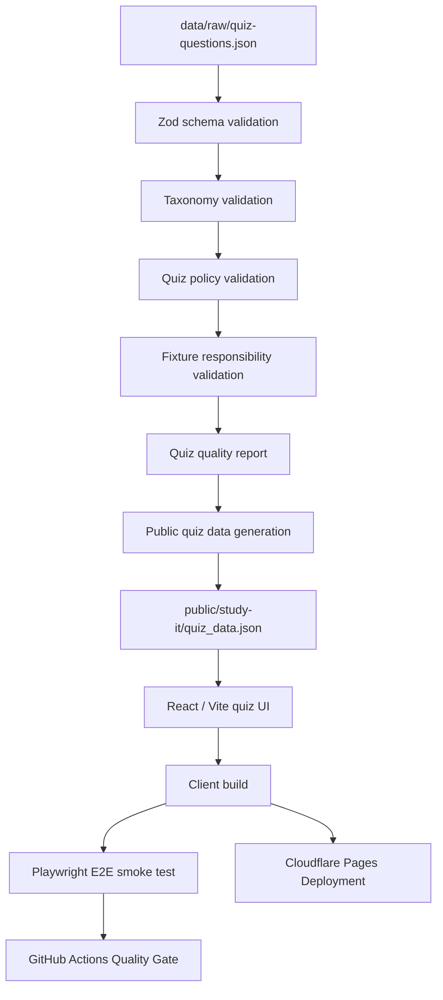

# Quiz App Quality Pipeline

## Overview

このドキュメントは、クイズアプリ編における data quality pipeline と deployment pipeline を整理する。

## Pipeline



## Data Boundary

```text
data/raw/quiz-questions.json:
  internal source of truth

public/study-it/quiz_data.json:
  public runtime data

legal / review metadata:
  kept in raw data
  excluded from public JSON
```

## Validation Layers

```text
Schema validation:
  validates structural correctness

Taxonomy validation:
  validates track / category / difficulty classification

Policy validation:
  validates legal and public safety constraints

Fixture responsibility validation:
  confirms invalid fixtures fail at the expected validation layer
```

## Runtime Boundary

```text
GitHub Actions:
  full quality gate
  includes Playwright E2E

Cloudflare Pages:
  deployment build
  excludes Playwright E2E
  deploys dist/app
```

## Build Outputs

```text
dist/app:
  React / Vite quiz app

dist/site:
  static quality report site

reports/:
  generated and maintained quality reports
```

