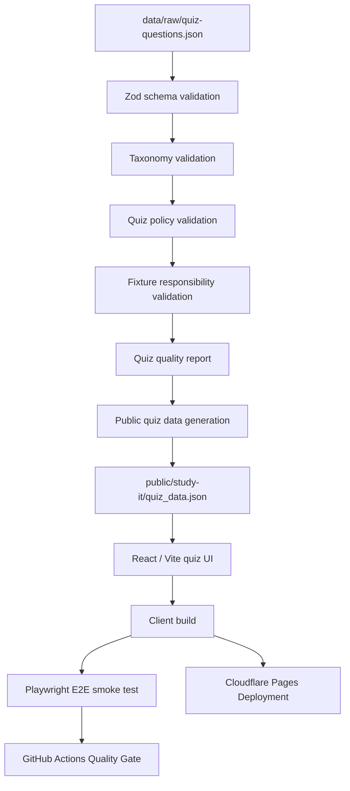

# クイズアプリのアーキテクチャ

## 概要

このドキュメントは、`qa-sre-learning-mvp` におけるクイズアプリの品質管理構造を整理するものです。

本プロジェクトでは、クイズUIそのものだけでなく、クイズデータの検証、公開用データの生成、クライアントビルド、E2Eテスト、GitHub Actions上の品質ゲート、Cloudflare Pagesへのデプロイまでを一連の流れとして扱います。

目的は、以下を再現可能に示すことです。

- クイズデータの構造を検証する
- 分野・カテゴリ・難易度の分類を検証する
- 公開リポジトリに含めるデータの安全性を確認する
- 異常系fixtureが想定した検証層で失敗することを確認する
- 公開用JSONを生成する
- React / ViteによるクイズUIをビルドする
- Playwrightで主要な操作フローを検証する
- GitHub Actionsで完全な品質ゲートを実行する
- Cloudflare Pagesで静的アプリケーションを公開する

---

## 全体構成



この流れでは、`data/raw/quiz-questions.json` を内部的な正本とし、検証済みの情報だけを `public/study-it/quiz_data.json` として公開します。

---

## データ境界

クイズデータは、内部用データと公開用データに分離します。

```text
data/raw/quiz-questions.json:
  内部的な正本データ。
  検証用メタデータ、参照元情報、レビュー用情報を含める。

public/study-it/quiz_data.json:
  クイズアプリが実行時に読み込む公開用データ。
  UI表示とクイズ実行に必要な情報のみを含める。

legal / review metadata:
  raw data側に保持する。
  public JSONには含めない。
```

この分離により、検証やレビューに必要な情報を保持しつつ、公開アプリ側では必要最小限のデータだけを扱います。

---

## 検証層

クイズデータは、複数の検証層で確認します。

| 検証層                            | 目的                                                                       |
| :-------------------------------- | :------------------------------------------------------------------------- |
| Schema validation                 | データ構造、必須項目、型の妥当性を検証する                                 |
| Taxonomy validation               | track、category、difficultyなどの分類が定義済み範囲に収まることを検証する  |
| Quiz policy validation            | 公開リポジトリや学習用途として不適切なデータが含まれていないことを検証する |
| Fixture responsibility validation | 異常系fixtureが想定した検証層で失敗することを確認する                      |
| Public data freshness check       | 生成済みpublic JSONがraw dataと同期していることを確認する                  |

この構造により、単に「データが読み込める」だけでなく、**どの検証層が何を保証するか**を明確にしています。

---

## 公開用データ生成

公開用クイズデータは、以下のコマンドで生成します。

```bash
bun run prepare:public-quiz-data
```

生成先は以下です。

```text
public/study-it/quiz_data.json
```

このファイルは、React / Viteクイズアプリが実行時に取得する公開データです。

公開用データの鮮度は、以下の品質ゲートで確認します。

```bash
bun run prepare:public-quiz-data:check
```

この検査では、raw dataからpublic JSONを再生成し、Git上の差分が発生しないことを確認します。

---

## 実行時境界

本プロジェクトでは、GitHub ActionsとCloudflare Pagesの責務を分離します。

```text
GitHub Actions:
  完全な品質ゲートを実行する。
  TypeScript検査、unit test、データ検証、レポート鮮度確認、client build、Playwright E2Eを含む。

Cloudflare Pages:
  デプロイ用ビルドを実行する。
  Playwright E2Eは含めず、公開用のdist/app生成に責務を限定する。
```

この分離により、GitHub Actionsでは品質保証を担い、Cloudflare Pagesでは配信可能な静的成果物の生成と公開に集中します。

---

## ビルド成果物

主なビルド成果物は以下です。

| 出力先                           | 内容                             |
| :------------------------------- | :------------------------------- |
| `dist/app`                       | React / Viteによるクイズアプリ   |
| `dist/site`                      | 品質レポート用の静的サイト       |
| `reports/`                       | 生成・管理される品質レポート     |
| `public/study-it/quiz_data.json` | クイズアプリが読み込む公開用JSON |

Cloudflare Pagesでは、主に `dist/app` を公開対象とします。

---

## 品質ゲートとの対応

完全な品質ゲートは以下で実行します。

```bash
CI=1 bun run check
```

クイズアプリに関係する主な検証は以下です。

```text
bun run client:typecheck:
  クライアント側TypeScriptの型検査を実行する。

bun run validate:quiz:
  クイズデータのschema / taxonomyを検証する。

bun run validate:quiz-policy:
  クイズデータの公開方針・安全性を検証する。

bun run validate:quiz-fixtures:
  異常系fixtureが想定した検証層で失敗することを確認する。

bun run quiz:report:check:
  クイズ品質レポートが最新であることを確認する。

bun run prepare:public-quiz-data:check:
  公開用クイズJSONがraw dataと同期していることを確認する。

bun run client:build:
  React / Viteクイズアプリをproduction buildする。

bun run test:e2e:
  Playwrightでクイズ操作の主要フローを検証する。
```

---

## デプロイ方針

Cloudflare Pagesでは、デプロイ用ビルドとして以下を実行します。

```bash
bun run pages:build
```

`pages:build` は、デプロイ可能な静的アプリケーションを生成することに責務を限定します。
完全な品質ゲートはGitHub Actions側で実行するため、Cloudflare Pages側ではPlaywright E2Eを実行しません。

この構成により、以下を両立します。

- GitHub Actionsでの厳密な品質確認
- Cloudflare Pagesでの安定したデプロイ
- local環境での再現可能な検証
- 公開用buildの責務明確化

---

## 設計上の判断

本プロジェクトでは、以下の設計判断を採用しています。

| 判断                                           | 理由                                                       |
| :--------------------------------------------- | :--------------------------------------------------------- |
| raw dataとpublic JSONを分離する                | 内部レビュー用情報を保持しつつ、公開データを最小化するため |
| validationを複数層に分ける                     | schema、分類、公開方針の責務を明確にするため               |
| 異常系fixtureを分離する                        | どの検証層がどの失敗を検出するかを確認するため             |
| GitHub ActionsとCloudflare Pagesの責務を分ける | 品質保証とデプロイ処理を混同しないため                     |
| E2Eを品質ゲートに含める                        | ユーザー視点の主要操作が壊れていないことを確認するため     |
| Dev Containerを用意する                        | 開発環境差による失敗を減らし、再現性を高めるため           |

---

## 今後の拡張余地

現時点では、以下は今後の拡張対象です。

- 出題範囲を絞り込む機能
- 問題順のシャッフル機能
- 回答内容の振り返り画面
- クイズデータの拡充
- アクセシビリティ確認の強化
- Lighthouse CIの運用強化
- デプロイ後の基本的な稼働確認

---

## 関連ドキュメント

| ドキュメント                              | 内容                       |
| :---------------------------------------- | :------------------------- |
| `README.md`                               | プロジェクト全体の入口     |
| `docs/acceptance-criteria.md`             | MVPの受け入れ基準          |
| `docs/interview-notes.md`                 | 面接説明用の補助資料       |
| `docs/quiz-schema-taxonomy-validation.md` | クイズデータ検証方針       |
| `reports/quiz-quality-report.md`          | クイズデータの品質レポート |
| `reports/portfolio-readiness.md`          | ポートフォリオ提出準備状況 |
