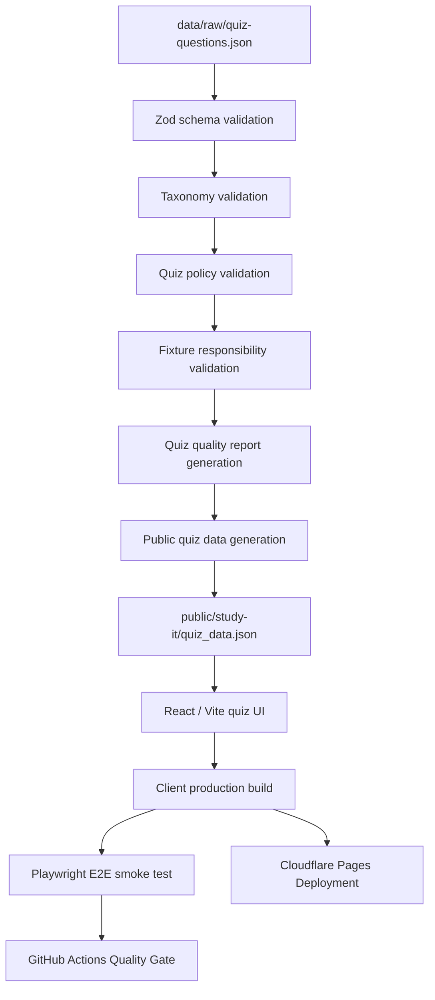

# アーキテクチャ

[docs/architecture/architecture.md](/docs/architecture/architecture.md)

## 概要

このドキュメントは、`qa-sre-learning-mvp` におけるクイズアプリの設計、データ境界、検証層、品質ゲート、デプロイ責務を整理するものです。

本プロジェクトのクイズアプリは、外部機関の試験問題や公式問題を再現するものではありません。
本リポジトリ自体のREADME、docs、reports、source code、CI/CD構成を題材として、ポートフォリオ成果物の技術スタック、品質保証メカニズム、デプロイ構成を理解するための内製クイズです。

現在のクイズは16問で構成され、以下の領域を扱います。

- プロジェクト概要
- データ品質パイプライン
- schema validation / taxonomy validation
- policy validation
- 品質ゲートとCI
- React / ViteクイズUI
- Cloudflare Pagesデプロイ
- ドキュメントと説明設計
- Git運用

目的は、以下を再現可能に示すことです。

- raw quiz dataを正本として管理する
- クイズデータの構造をschemaで検証する
- category / sub_category / sub_sub_categoryの分類整合性を検証する
- 外部試験問題参照や公開リスクをpolicy validationで検出する
- 異常系fixtureが想定した検証層で失敗することを確認する
- クイズ品質レポートを生成する
- React / Vite UIが読み込む公開用JSONを生成する
- Playwrightで主要な操作フローを検証する
- GitHub Actionsで完全な品質ゲートを実行する
- Cloudflare Pagesで静的アプリケーションを公開する

---

## 全体構成



この流れでは、[data/raw/quiz-questions.json](/data/raw/quiz-questions.json) を内部的な正本とし、検証済みの表示用データだけを [public/study-it/quiz_data.json](/public/study-it/quiz_data.json) として生成します。

---

## データ境界

クイズデータは、内部用データと公開用データに分離します。

| 対象                                                              | 役割・内容                                                                                                                                      |
| ----------------------------------------------------------------- | ----------------------------------------------------------------------------------------------------------------------------------------------- |
| [data/raw/quiz-questions.json](/data/raw/quiz-questions.json)     | クイズ問題の正本データ。`question`、`options`、`answer`、`explanation`に加え、`source`、`legal`、`review`、`tags`などの検証用メタデータを含む。 |
| [data/raw/subject-taxonomy.json](/data/raw/subject-taxonomy.json) | クイズ分類体系の正本データ。`category`、`sub_category`、`sub_sub_category`の定義を保持する。                                                    |
| [reports/quiz-quality-report.md](/reports/quiz-quality-report.md) | raw quiz dataとtaxonomyから生成される品質レポート。問題数、track分布、category分布、publisher分布、coverageなどを可視化する。                   |
| [public/study-it/quiz_data.json](/public/study-it/quiz_data.json) | React / Viteクイズアプリが実行時に読み込む公開用JSON。UI表示とクイズ実行に必要な情報のみを含む。                                                |
| `legal / review metadata`                                         | raw data側に保持し、public JSONには原則として含めない。                                                                                         |

この分離により、検証やレビューに必要な内部情報を保持しつつ、公開アプリ側では必要最小限のデータだけを扱います。

---

## クイズデータの位置づけ

本プロジェクトのクイズデータは、外部試験対策用データではありません。

| 項目         | 方針                                                                                                                                             |
| ------------ | ------------------------------------------------------------------------------------------------------------------------------------------------ |
| 題材         | 本リポジトリの構成、品質ゲート、検証処理、UI、デプロイ、ドキュメント                                                                             |
| 正本         | [data/raw/quiz-questions.json](/data/raw/quiz-questions.json)                                                                                    |
| 分類体系     | [data/raw/subject-taxonomy.json](/data/raw/subject-taxonomy.json)                                                                                |
| 公開用データ | [public/study-it/quiz_data.json](/public/study-it/quiz_data.json)                                                                                |
| source       | [README.md](/README.md)、[docs/](/docs/) 、[reports/](/reports/)、[src/](/src/)、[e2e/](/e2e/)、[package.json](/package.json) などのrepo内部path |
| 除外対象     | 外部機関の公式問題、過去問、実問再現、認定試験対策                                                                                               |
| 公開方針     | 内部review metadataやlegal metadataはpublic JSONへ出しすぎない                                                                                   |

---

## Taxonomy設計

現在のtaxonomyは、ポートフォリオ理解用に再構成しています。

| Category                      | Label                    | 目的                                                     |
| ----------------------------- | ------------------------ | -------------------------------------------------------- |
| `project_overview`            | プロジェクト概要         | MVPの目的と成果物構成を理解する                          |
| `data_quality_pipeline`       | データ品質パイプライン   | raw data、public data、report生成の関係を理解する        |
| `schema_taxonomy_validation`  | スキーマ検証と分類検証   | Zod schemaとtaxonomy validationの役割を理解する          |
| `policy_validation`           | ポリシー検証             | 外部試験問題参照の排除、review状態、公開安全性を理解する |
| `quality_gate_ci`             | 品質ゲートとCI           | `CI=1 bun run check` とGitHub Actionsの役割を理解する    |
| `frontend_quiz_ui`            | クイズUI                 | React / Vite UIと公開用JSONの関係を理解する              |
| `deployment_cloudflare_pages` | Cloudflare Pagesデプロイ | build outputと静的配信の責務を理解する                   |
| `documentation_workflow`      | ドキュメントと説明設計   | README、docs、reportsの説明責務を理解する                |
| `git_workflow`                | Git運用                  | branch、pull request、品質ゲート統合の流れを理解する     |

Dev Containerは開発環境の再現性を高める補助機能ですが、今回のクイズtaxonomyでは主要出題カテゴリには含めません。

---

## 検証層

クイズデータは、複数の検証層で確認します。

| 検証層                              | 目的                                                                             |
| ----------------------------------- | -------------------------------------------------------------------------------- |
| `Schema validation`                 | データ構造、必須項目、型、選択肢、正答、source、reviewなどの妥当性を検証する     |
| `Taxonomy validation`               | category、sub_category、sub_sub_categoryがtaxonomyの正本と整合することを検証する |
| `Quiz policy validation`            | repo内部source、review状態、外部試験参照排除、公開安全性などを検証する           |
| `Fixture responsibility validation` | 異常系fixtureが想定した検証層で失敗することを確認する                            |
| `Quiz quality report check`         | 生成済みレポートがraw dataと同期していることを確認する                           |
| `Public data freshness check`       | 生成済みpublic JSONがraw dataと同期していることを確認する                        |
| `Playwright E2E`                    | ユーザー視点で主要操作フローが壊れていないことを確認する                         |

この構造により、単に「データが読み込める」だけでなく、どの検証層が何を保証するかを明確にします。

---

## Schema validation

schema validationは、JSONデータの構造的な妥当性を確認します。

主に以下を検査します。

- `id` が存在すること
- `track` が定義済みenumに含まれること
- `category` が定義済みtaxonomy keyに含まれること
- `sub_category`、`sub_sub_category` が文字列として存在すること
- `question`、`options`、`answer`、`explanation` が成立していること
- `source` が必要な項目を持つこと
- `legal`、`review` が検証用メタデータとして成立していること
- `tags` が1件以上存在すること

新仕様では、`source.url` は外部URLに限定しません。
repo内部pathをsourceとして扱うため、`README.md`、`docs/architecture.md`、`src/application/validate-quiz-policy.ts` のような値を許容します。

---

## Taxonomy validation

taxonomy validationは、クイズ問題に付与された分類が `data/raw/subject-taxonomy.json` と整合しているかを検査します。

主な検査対象は以下です。

```text
question.category
question.sub_category
question.sub_sub_category
```

また、IDとcategoryの対応も検査します。

```text
id must start with category prefix
```

例:

```text
project_overview-001:
  OK

project-overview-001:
  NG
```

この規則により、問題IDを見ただけで所属categoryを追跡しやすくしています。

---

## Quiz policy validation

policy validationは、クイズデータが本プロジェクトの公開方針に合っているかを検査します。

主な検査対象は以下です。

| Rule                                | 目的                                                         |
| ----------------------------------- | ------------------------------------------------------------ |
| `internal-source-required`          | sourceがrepo内部pathを参照していることを確認する             |
| `source-publisher-internal`         | publisherが `qa-sre-learning-mvp` であることを確認する       |
| `project-scope-only`                | 問題内容が本ポートフォリオの範囲に収まることを確認する       |
| `review-required`                   | production用クイズデータがreview済みであることを確認する     |
| `review-date-required`              | review済みデータにreview日があることを確認する               |
| `no-verbatim-copy`                  | 第三者資料の丸写しでないことを確認する                       |
| `no-official-question-reproduction` | 外部公式問題の再現を含まないことを確認する                   |
| `no-official-certification-claim`   | 公式認定・公式試験・公式教材であるかのような主張を防ぐ       |
| `no-affiliation-endorsement-claim`  | 第三者による提携、後援、承認、支援を示唆しないことを確認する |
| `no-external-exam-claim`            | 外部試験対策や実問再現と誤認されるmetadataを防ぐ             |
| `official-misrepresentation-text`   | 公式性・提携性の誤認につながるmetadataを検出する             |
| `no-secret-like-text`               | token、password、private key風の文字列を検出する             |

この検証は法的判断の代替ではなく、公開前の安全確認とデータ品質向上を目的とした品質ゲートです。

---

## Fixture responsibility validation

異常系fixtureは、どの検証層で失敗すべきかを分けて管理します。

| Fixture                                                                                               | 期待される挙動                                                    |
| ----------------------------------------------------------------------------------------------------- | ----------------------------------------------------------------- |
| [data/fixtures/invalid-quiz-schema.json](/data/fixtures/invalid-quiz-schema.json)                     | schema validationで失敗する                                       |
| [data/fixtures/invalid-quiz-taxonomy.json](/data/fixtures/invalid-quiz-taxonomy.json)                 | schema validationは通過し、taxonomy validationで失敗する          |
| [data/fixtures/policy-invalid-quiz-questions.json](/data/fixtures/policy-invalid-quiz-questions.json) | schema / taxonomy validationは通過し、policy validationで失敗する |

この設計により、検証層の責務が混ざっていないことを確認できます。

---

## クイズ品質レポート

クイズ品質レポートは、以下のコマンドで生成します。

```bash
bun run quiz:report
```

生成先は以下です。

```text
reports/quiz-quality-report.md
```

このレポートでは、主に以下を確認します。

- 総問題数
- taxonomy issue count
- policy issue count
- track分布
- category分布
- difficulty分布
- source publisher分布
- review status分布
- legal flag summary
- taxonomy coverage

レポートが最新であることは、以下で確認します。

```bash
bun run quiz:report:check
```

この検査では、レポートを再生成し、Git差分が発生しないことを確認します。

---

## 公開用データ生成

公開用クイズデータは、以下のコマンドで生成します。

```bash
bun run prepare:public-quiz-data
```

生成先は以下です。

```text
public/study-it/quiz_data.json
```

このファイルは、React / Viteクイズアプリが実行時に取得する公開データです。

公開用データの鮮度は、以下の品質ゲートで確認します。

```bash
bun run prepare:public-quiz-data:check
```

この検査では、raw dataからpublic JSONを再生成し、Git上の差分が発生しないことを確認します。

---

## 実行時境界

本プロジェクトでは、GitHub ActionsとCloudflare Pagesの責務を分離します。

```text
GitHub Actions:
  完全な品質ゲートを実行する。
  TypeScript検査、unit test、データ検証、レポート鮮度確認、client build、Playwright E2Eを含む。

Cloudflare Pages:
  デプロイ用ビルドを実行する。
  Playwright E2Eは含めず、公開用のdist/app生成に責務を限定する。
```

この分離により、GitHub Actionsでは品質保証を担い、Cloudflare Pagesでは配信可能な静的成果物の生成と公開に集中します。

---

## ビルド成果物

主なビルド成果物は以下です。

| 出力先                                                            | 内容                             | commit方針       |
| ----------------------------------------------------------------- | -------------------------------- | ---------------- |
| [dist/app](/dist/app)                                             | React / Viteによるクイズアプリ   | 原則commitしない |
| [dist/site](/dist/site)                                           | 品質レポート用の静的サイト       | 原則commitしない |
| [reports/quality-report.md](/reports/quality-report.md)           | 学習データの品質レポート         | commit対象 `     |
| [reports/quiz-quality-report.md](/reports/quiz-quality-report.md) | クイズデータの品質レポート       | commit対象       |
| [public/study-it/quiz_data.json](/public/study-it/quiz_data.json) | クイズアプリが読み込む公開用JSON | commit対象       |

Cloudflare Pagesでは、主に `dist/app` を公開対象とします。

---

## 品質ゲートとの対応

完全な品質ゲートは以下で実行します。

```bash
CI=1 bun run check
```

クイズアプリに関係する主な検証は以下です。

```text
bun run client:typecheck:
  クライアント側TypeScriptの型検査を実行する。

bun run validate:quiz:
  クイズデータのschema / taxonomyを検証する。

bun run validate:quiz-policy:
  クイズデータの公開方針・安全性を検証する。

bun run validate:quiz-fixtures:
  異常系fixtureが想定した検証層で失敗することを確認する。

bun run quiz:report:check:
  クイズ品質レポートが最新であることを確認する。

bun run prepare:public-quiz-data:check:
  公開用クイズJSONがraw dataと同期していることを確認する。

bun run client:build:
  React / Viteクイズアプリをproduction buildする。

bun run test:e2e:
  Playwrightでクイズ操作の主要フローを検証する。
```

E2Eでは、問題文の固定値ではなく、ユーザー操作として重要な流れを検証します。

```text
- アプリが読み込まれる
- 問題が表示される
- 選択肢をクリックできる
- 正誤フィードバックが表示される
- 次の問題へ進める
- 結果画面が表示される
- カテゴリ別スコアが表示される
- もう一度解くことで初期状態へ戻れる
```

---

## デプロイ方針

Cloudflare Pagesでは、デプロイ用ビルドとして以下を実行します。

```bash
bun run pages:build
```

`pages:build` は、デプロイ可能な静的アプリケーションを生成することに責務を限定します。
完全な品質ゲートはGitHub Actions側で実行するため、Cloudflare Pages側ではPlaywright E2Eを実行しません。

この構成により、以下を両立します。

- GitHub Actionsでの厳密な品質確認
- Cloudflare Pagesでの安定したデプロイ
- local環境での再現可能な検証
- 公開用buildの責務明確化

---

## 設計上の判断

本プロジェクトでは、以下の設計判断を採用しています。

| 判断                                           | 理由                                                                       |
| ---------------------------------------------- | -------------------------------------------------------------------------- |
| クイズ題材をrepo内部成果物に限定する           | 外部試験問題再現リスクを避け、ポートフォリオ理解用教材として位置づけるため |
| raw dataとpublic JSONを分離する                | 内部レビュー用情報を保持しつつ、公開データを最小化するため                 |
| sourceにrepo内部pathを使う                     | 問題の根拠をREADME、docs、reports、source codeへ接続するため               |
| validationを複数層に分ける                     | schema、分類、公開方針の責務を明確にするため                               |
| 異常系fixtureを分離する                        | どの検証層がどの失敗を検出するかを確認するため                             |
| レポートとpublic JSONを生成物としてcommitする  | raw dataとの同期を品質ゲートで確認するため                                 |
| GitHub ActionsとCloudflare Pagesの責務を分ける | 品質保証とデプロイ処理を混同しないため                                     |
| E2Eを品質ゲートに含める                        | ユーザー視点の主要操作が壊れていないことを確認するため                     |
| Dev Containerを補助機能として用意する          | 開発環境差による失敗を減らし、再現性を高めるため                           |

---

## 更新ワークフロー

クイズ問題またはtaxonomyを更新した場合は、以下の順序で検証します。

```bash
bun run validate:quiz
bun run validate:quiz-policy
bun run validate:quiz-fixtures

bun run quiz:report
bun run prepare:public-quiz-data

bun run quiz:report:check
bun run prepare:public-quiz-data:check

CI=1 bun run check
```

生成物をcommitする場合は、以下を含めます。

```bash
git add reports/quiz-quality-report.md public/study-it/quiz_data.json
```

---

## 今後の拡張余地

現時点では、以下は今後の拡張対象です。

- クイズ問題数の拡充
  - 16問から20〜24問程度へ増やし、taxonomy coverageを高める。

- taxonomy coverageの改善
  - `documentation_workflow`、`git_workflow`、`policy_validation`、`quality_gate_ci` の未カバーsub categoryを補う。

- 出題範囲の絞り込み
  - track、category、difficulty単位で出題対象を選択できるようにする。

- 回答内容の振り返り画面
  - 結果画面から、各問題の選択回答、正答、解説を確認できるようにする。

- E2Eの強化
  - 問題数固定や曖昧なtext selectorに依存しない形で、主要操作の回帰検出力を高める。

- レポートの拡張
  - internal source path distribution、policy rule coverage、fixture responsibility summaryを追加する。

- デプロイ後の稼働確認
  - 公開URLへアクセスできること、public quiz dataを取得できることを確認する簡易smoke checkを追加する。

- アクセシビリティ確認の強化
  - キーボード操作、見出し構造、色によらない情報提示などを追加で検証する。

---

## 関連ドキュメント

| ドキュメント                                                                        | 内容                       |
| ----------------------------------------------------------------------------------- | -------------------------- |
| [README.md](/README.md)                                                             | プロジェクト全体の入口     |
| [docs/acceptance-criteria.md](/docs/acceptance-criteria.md)                         | MVPの受け入れ基準          |
| [docs/interview/quiz-app-explanation.md](/docs/interview/quiz-app-explanation.md)   | 面接説明用の補助資料       |
| [docs/quiz-schema-taxonomy-validation.md](/docs/quiz-schema-taxonomy-validation.md) | クイズデータ検証方針       |
| [reports/quality-report.md](reports/quality-report.md)                              | 学習データの品質レポート   |
| [reports/quiz-quality-report.md](/reports/quiz-quality-report.md)                   | クイズデータの品質レポート |
| [reports/portfolio-readiness.md](/reports/portfolio-readiness.md)                   | ポートフォリオ提出準備状況 |
|                                                                                     |                            |
